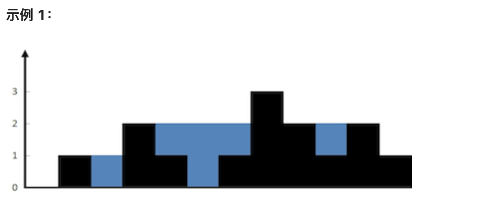

这道题是极其经典的 **LeetCode 42. 接雨水 (Trapping Rain Water)**。

下面为您梳理**核心解题思路**、**双指针优化原理**、**边界条件**以及最符合 Go 语言工程规范的**最优解代码**。

---



### 一、 核心解题思路

#### 1. 木桶原理（短板效应）

对于任何位置 $i$ 的柱子，它上方能存多少水，取决于它**左边的最高柱子** `leftMax` 和**右边的最高柱子** `rightMax` 中**较矮的那一个**（即短板）：

$$\text{水高度}[i] = \min(\text{leftMax}, \text{rightMax}) - \text{height}[i]$$

如果短板小于或等于 `height[i]`，则该位置无法存水（计算结果为 0 或负数）。

#### 2. 为什么双指针是 $O(1)$ 空间的最优解？

传统的动态规划解法需要维护两个数组分别存储每一个位置的 `leftMax` 和 `rightMax`，空间复杂度为 $O(N)$。

而**双指针法**可以在 $O(1)$ 空间内解决：

- 用 `left` 指向数组头部，`right` 指向数组尾部，同时维护全局变量 `leftMax` 和 `rightMax`。
- **关键突破点**：只要 `leftMax < rightMax`，哪怕此时 `right` 指针左边还有更高的柱子，`left` 处的短板也**绝对确定是 `leftMax**`，因此可以放心计算 `left`处的存水量，并将`left` 右移。
- 反之，如果 `leftMax >= rightMax`，则 `right` 处的短板一定确定是 `rightMax`，计算 `right` 处的存水量并将 `right` 左移。

---

### 二、 边界条件

在编写代码时，需要对以下边界情况做出防御性处理：

1. **切片为 `nil` 或长度小于 3**：
   至少需要 3 根柱子（左墙、水槽、右墙）才有可能接住雨水。如果长度小于 3，直接返回 `0`。
2. **单调递增或单调递减数组**：如 `[1, 2, 3, 4]` 或 `[4, 3, 2, 1]`，双指针会在遍历中正确更新 `leftMax` / `rightMax` 导致求和增加量全为 `0`，无需特判即可自然兼容。

---

### 三、 Golang 最优解代码实现

```go
package main

import "fmt"

// trap 计算柱子间能接多少雨水
// 时间复杂度: O(N) - 两个指针相向而行，仅需遍历数组一次
// 空间复杂度: O(1) - 仅使用常数级别的指针与临时变量
func trap(height []int) int {
	// 边界处理：小于 3 根柱子无法形成水槽，直接返回 0
	if len(height) < 3 {
		return 0
	}

	left, right := 0, len(height)-1
	leftMax, rightMax := 0, 0
	totalWater := 0

	// 左右指针相向移动，直到相遇
	for left < right {
		// 1. 实时更新左右两边各自遍历过的最大高度
		if height[left] > leftMax {
			leftMax = height[left]
		}
		if height[right] > rightMax {
			rightMax = height[right]
		}

		// 2. 依据短板效应进行状态转移
		if leftMax < rightMax {
			// 左侧是短板，left 处的接水量只由 leftMax 决定
			totalWater += leftMax - height[left]
			left++
		} else {
			// 右侧是短板，right 处的接水量只由 rightMax 决定
			totalWater += rightMax - height[right]
			right--
		}
	}

	return totalWater
}

func main() {
	// 题目示例验证
	input := []int{0, 1, 0, 2, 1, 0, 1, 3, 2, 1, 2, 1}
	fmt.Printf("输入: %v\n", input)
	fmt.Printf("输出: %d\n\n", trap(input)) // 输出: 6

	// 边界测试：长度小于 3
	fmt.Printf("边界用例 (<3): %d\n", trap([]int{2, 1})) // 输出: 0

	// 边界测试：无法接水的梯形递增
	fmt.Printf("边界用例 (递增): %d\n", trap([]int{1, 2, 3, 4})) // 输出: 0
}

```

---

### 四、 代码推演示例（以示例 `[0,1,0,2,1,0,1,3,2,1,2,1]` 为例）

1. 初始状态：`left = 0`, `right = 11`；`leftMax = 0`, `rightMax = 0`。
2. 更新：`leftMax = 0` (`height[0]`), `rightMax = 1` (`height[11]`)。
3. `leftMax < rightMax` (0 < 1)：处理 `left`，水 += `0 - 0 = 0`，`left++` (1)。
4. `left=1`: `leftMax` 更新为 `1`。`leftMax < rightMax` (1 < 1 为假，走 `else`)，处理 `right` (11)，水 += `1 - 1 = 0`，`right--` (10)。
5. `right=10`: `rightMax` 更新为 `2`。`leftMax < rightMax` (1 < 2)，处理 `left` (1)，水 += `1 - 1 = 0`，`left++` (2)。
6. `left=2`: `height[2]=0`。`leftMax` 依然是 `1`。`leftMax < rightMax` (1 < 2)，处理 `left` (2)，水 += `1 - 0 = 1`，`left++` (3)。
7. 依次循环，最终得出总接水量为 **`6`**。
